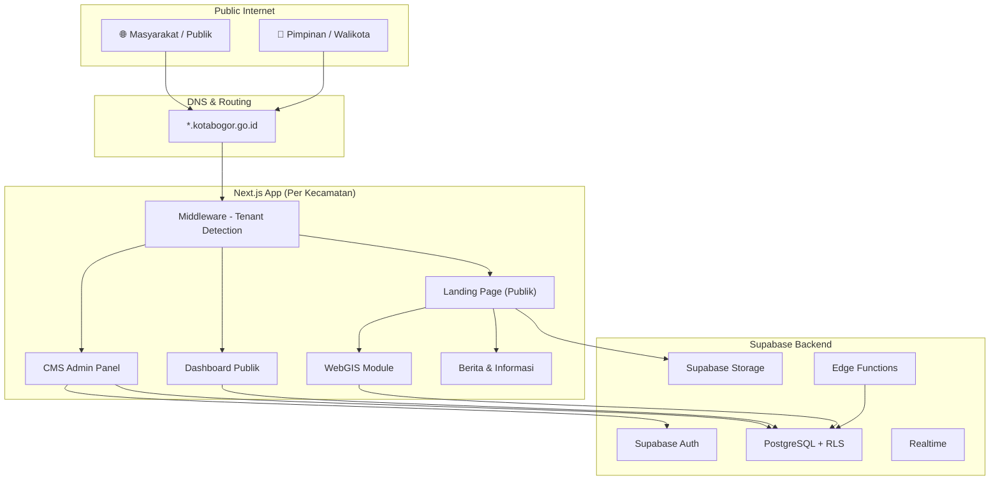
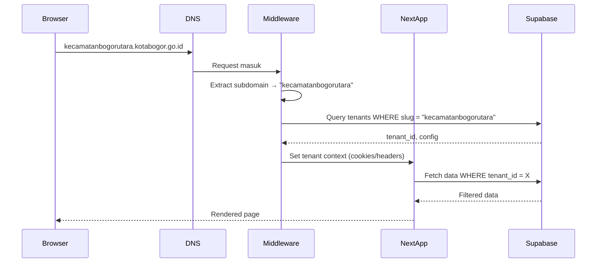
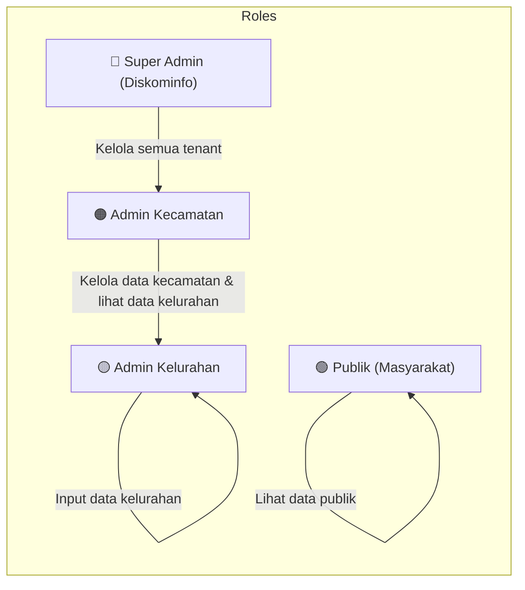
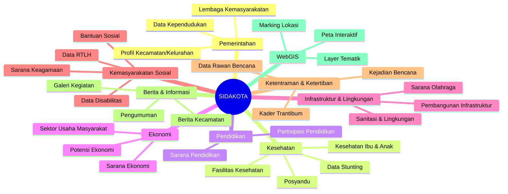
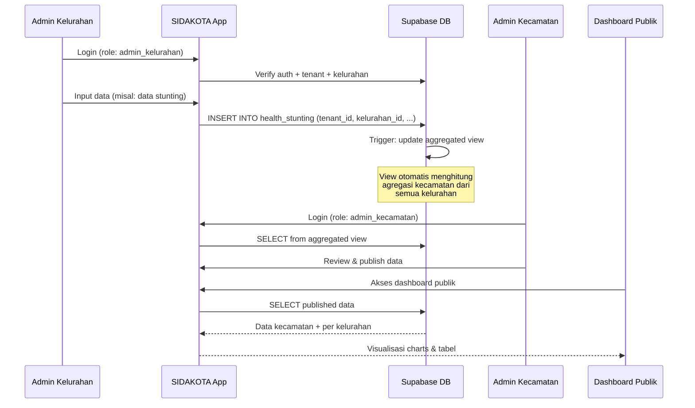
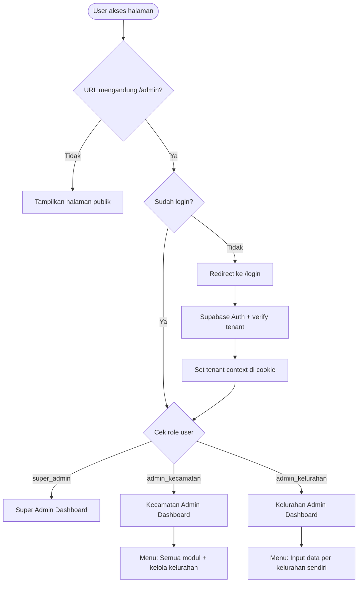
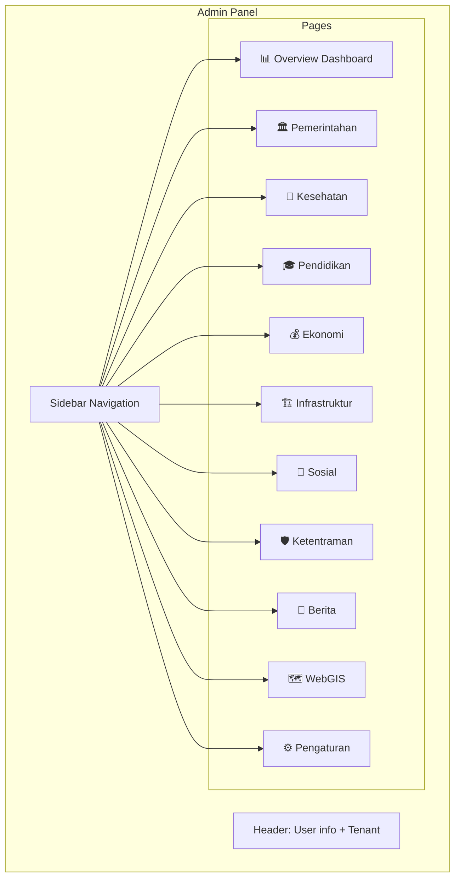
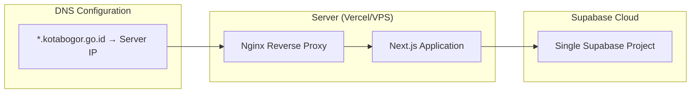

# SIDAKOTA — Sistem Informasi Dashboard Kota Bogor (Kecamatan & Kelurahan)

Aplikasi dashboard multi-tenant untuk menampilkan data kecamatan dan kelurahan se-Kota Bogor. Setiap kecamatan di-deploy dengan subdomain tersendiri (misal: `kecamatanbogorutara.kotabogor.go.id`). Kelurahan sebagai sumber data (input), kecamatan sebagai agregator & pengelola, dan masyarakat sebagai pengguna publik.

> [!IMPORTANT]
> Dokumen ini merupakan **Blueprint Lengkap** yang mencakup: Core Function, Architecture, Database Schema, Flow Diagram, Module Breakdown, dan Deployment Strategy. Mohon di-review sebelum memulai implementasi.

---

## 1. Ringkasan Arsitektur



---

## 2. Strategi Multi-Tenant

### Pendekatan: **Single Codebase, Subdomain-Based Tenant Resolution**

Satu codebase Next.js yang di-deploy sekali, tenant di-resolve via subdomain middleware.



### Data Kecamatan Kota Bogor (6 Kecamatan, 68 Kelurahan)

| No | Kecamatan | Slug Subdomain | Jumlah Kelurahan |
|----|-----------|----------------|-----------------|
| 1 | Bogor Utara | `bogorutara` | 8 |
| 2 | Bogor Timur | `bogortimur` | 6 |
| 3 | Bogor Selatan | `bogorselatan` | 16 |
| 4 | Bogor Barat | `bogorbarat` | 16 |
| 5 | Bogor Tengah | `bogortengah` | 11 |
| 6 | Tanah Sareal | `tanahsareal` | 11 |

---

## 3. Core Functions & Module Breakdown

### 3.1 Hirarki Akses Pengguna



| Role | Akses | Deskripsi |
|------|-------|-----------|
| **Super Admin** | Full Access | Mengelola tenant, seed data, konfigurasi global |
| **Admin Kecamatan** | Tenant-scoped Write | Kelola profil kecamatan, approve data kelurahan, kelola berita, setting website |
| **Admin Kelurahan** | Kelurahan-scoped Write | Input data per kategori, upload dokumen, kelola profil kelurahan |
| **Publik** | Read-only | Lihat dashboard, berita, WebGIS, data statistik |

### 3.2 Modul Utama



---

## 4. Detail Modul & Data Model

> [!IMPORTANT]
> Semua tabel aplikasi SIDAKOTA menggunakan schema khusus `sidakota` (bukan `public`) untuk isolasi dan keamanan yang lebih baik. Schema dibuat di awal migration:
> ```sql
> CREATE SCHEMA IF NOT EXISTS sidakota;
> ```
> Semua tabel di bawah menggunakan prefix `sidakota.` (contoh: `sidakota.gov_profiles`).

### 4.1 Modul Pemerintahan

#### Tabel: `sidakota.gov_profiles`
```sql
CREATE TABLE gov_profiles (
  id UUID PRIMARY KEY DEFAULT gen_random_uuid(),
  tenant_id UUID REFERENCES tenants(id) NOT NULL,
  kelurahan_id UUID REFERENCES kelurahans(id), -- NULL = data kecamatan
  nama_pimpinan TEXT,
  nip TEXT,
  jabatan TEXT,
  alamat_kantor TEXT,
  telepon TEXT,
  email TEXT,
  visi TEXT,
  misi JSONB, -- array of text
  foto_pimpinan TEXT, -- storage path
  foto_kantor TEXT,
  sejarah TEXT,
  wilayah_geografis JSONB,
  struktur_organisasi JSONB,
  tahun_data INT DEFAULT EXTRACT(YEAR FROM NOW()),
  created_at TIMESTAMPTZ DEFAULT NOW(),
  updated_at TIMESTAMPTZ DEFAULT NOW(),
  created_by UUID REFERENCES auth.users(id),
  status TEXT DEFAULT 'draft' CHECK (status IN ('draft','published','archived'))
);
```

#### Tabel: `sidakota.gov_population`
```sql
CREATE TABLE gov_population (
  id UUID PRIMARY KEY DEFAULT gen_random_uuid(),
  tenant_id UUID NOT NULL,
  kelurahan_id UUID,
  tahun INT NOT NULL,
  bulan INT, -- NULL = data tahunan
  jumlah_penduduk INT,
  jumlah_kk INT,
  laki_laki INT,
  perempuan INT,
  wni INT,
  wna INT,
  distribusi_umur JSONB, -- {"0-4": 100, "5-9": 150, ...}
  distribusi_pendidikan JSONB,
  distribusi_pekerjaan JSONB,
  distribusi_agama JSONB,
  mutasi_datang INT,
  mutasi_pindah INT,
  mutasi_lahir INT,
  mutasi_meninggal INT,
  kepadatan_per_km2 NUMERIC,
  created_at TIMESTAMPTZ DEFAULT NOW(),
  updated_at TIMESTAMPTZ DEFAULT NOW(),
  created_by UUID
);
```

#### Tabel: `sidakota.gov_community_orgs`
```sql
CREATE TABLE gov_community_orgs (
  id UUID PRIMARY KEY DEFAULT gen_random_uuid(),
  tenant_id UUID NOT NULL,
  kelurahan_id UUID,
  jenis TEXT NOT NULL, -- 'RT','RW','LPM','PKK','Karang Taruna','Posyandu'
  nama TEXT,
  ketua TEXT,
  jumlah_anggota INT,
  sk_number TEXT,
  tanggal_sk DATE,
  alamat TEXT,
  status_aktif BOOLEAN DEFAULT true,
  tahun_data INT,
  created_at TIMESTAMPTZ DEFAULT NOW(),
  created_by UUID
);
```

### 4.2 Modul Kesehatan

#### Tabel: `sidakota.health_facilities`
```sql
CREATE TABLE health_facilities (
  id UUID PRIMARY KEY DEFAULT gen_random_uuid(),
  tenant_id UUID NOT NULL,
  kelurahan_id UUID,
  nama TEXT NOT NULL,
  jenis TEXT NOT NULL, -- 'Puskesmas','Klinik','RS','Apotek','Posyandu','Posbindu'
  alamat TEXT,
  koordinat POINT,
  kapasitas INT,
  jumlah_tenaga_medis INT,
  fasilitas JSONB, -- array of services
  jam_operasional JSONB,
  telepon TEXT,
  status_aktif BOOLEAN DEFAULT true,
  tahun_data INT,
  created_at TIMESTAMPTZ DEFAULT NOW(),
  created_by UUID
);
```

#### Tabel: `sidakota.health_stunting`
```sql
CREATE TABLE health_stunting (
  id UUID PRIMARY KEY DEFAULT gen_random_uuid(),
  tenant_id UUID NOT NULL,
  kelurahan_id UUID,
  tahun INT NOT NULL,
  bulan INT,
  jumlah_balita INT,
  jumlah_stunting INT,
  jumlah_gizi_buruk INT,
  jumlah_gizi_kurang INT,
  jumlah_normal INT,
  prevalensi_stunting NUMERIC,
  intervensi JSONB, -- array of programs
  created_at TIMESTAMPTZ DEFAULT NOW(),
  created_by UUID
);
```

#### Tabel: `sidakota.health_posyandu`
```sql
CREATE TABLE health_posyandu (
  id UUID PRIMARY KEY DEFAULT gen_random_uuid(),
  tenant_id UUID NOT NULL,
  kelurahan_id UUID,
  nama TEXT,
  strata TEXT, -- 'Pratama','Madya','Purnama','Mandiri'
  jumlah_kader INT,
  jumlah_balita_terdaftar INT,
  jumlah_ibu_hamil INT,
  jumlah_lansia INT,
  alamat TEXT,
  koordinat POINT,
  jadwal_kegiatan JSONB,
  tahun_data INT,
  created_at TIMESTAMPTZ DEFAULT NOW(),
  created_by UUID
);
```

#### Tabel: `sidakota.health_maternal`
```sql
CREATE TABLE health_maternal (
  id UUID PRIMARY KEY DEFAULT gen_random_uuid(),
  tenant_id UUID NOT NULL,
  kelurahan_id UUID,
  tahun INT NOT NULL,
  bulan INT,
  jumlah_ibu_hamil INT,
  kunjungan_k1 INT,
  kunjungan_k4 INT,
  persalinan_nakes INT,
  kematian_ibu INT,
  kematian_bayi INT,
  imunisasi_lengkap INT,
  asi_eksklusif INT,
  created_at TIMESTAMPTZ DEFAULT NOW(),
  created_by UUID
);
```

### 4.3 Modul Pendidikan

#### Tabel: `sidakota.edu_facilities`
```sql
CREATE TABLE edu_facilities (
  id UUID PRIMARY KEY DEFAULT gen_random_uuid(),
  tenant_id UUID NOT NULL,
  kelurahan_id UUID,
  nama TEXT NOT NULL,
  jenjang TEXT NOT NULL, -- 'PAUD','TK','SD','SMP','SMA','SMK','PT'
  status_sekolah TEXT, -- 'Negeri','Swasta'
  akreditasi TEXT,
  jumlah_siswa INT,
  jumlah_guru INT,
  jumlah_ruang_kelas INT,
  alamat TEXT,
  koordinat POINT,
  npsn TEXT,
  tahun_data INT,
  created_at TIMESTAMPTZ DEFAULT NOW(),
  created_by UUID
);
```

#### Tabel: `sidakota.edu_participation`
```sql
CREATE TABLE edu_participation (
  id UUID PRIMARY KEY DEFAULT gen_random_uuid(),
  tenant_id UUID NOT NULL,
  kelurahan_id UUID,
  tahun INT NOT NULL,
  jenjang TEXT NOT NULL,
  anak_usia_sekolah INT,
  anak_bersekolah INT,
  angka_partisipasi_kasar NUMERIC,
  angka_partisipasi_murni NUMERIC,
  angka_putus_sekolah INT,
  angka_melanjutkan NUMERIC,
  created_at TIMESTAMPTZ DEFAULT NOW(),
  created_by UUID
);
```

### 4.4 Modul Ekonomi

#### Tabel: `sidakota.econ_facilities`
```sql
CREATE TABLE econ_facilities (
  id UUID PRIMARY KEY DEFAULT gen_random_uuid(),
  tenant_id UUID NOT NULL,
  kelurahan_id UUID,
  nama TEXT,
  jenis TEXT NOT NULL, -- 'Pasar','Minimarket','Warung','Mall','Bank','Koperasi','BMT'
  alamat TEXT,
  koordinat POINT,
  status_aktif BOOLEAN DEFAULT true,
  tahun_data INT,
  created_at TIMESTAMPTZ DEFAULT NOW(),
  created_by UUID
);
```

#### Tabel: `sidakota.econ_potential`
```sql
CREATE TABLE econ_potential (
  id UUID PRIMARY KEY DEFAULT gen_random_uuid(),
  tenant_id UUID NOT NULL,
  kelurahan_id UUID,
  tahun INT NOT NULL,
  jenis_potensi TEXT, -- 'Pertanian','Perikanan','Industri Kecil','Pariwisata','UMKM','Jasa'
  deskripsi TEXT,
  jumlah_pelaku INT,
  estimasi_omzet NUMERIC,
  produk_unggulan JSONB,
  created_at TIMESTAMPTZ DEFAULT NOW(),
  created_by UUID
);
```

#### Tabel: `sidakota.econ_business_sectors`
```sql
CREATE TABLE econ_business_sectors (
  id UUID PRIMARY KEY DEFAULT gen_random_uuid(),
  tenant_id UUID NOT NULL,
  kelurahan_id UUID,
  tahun INT NOT NULL,
  sektor TEXT NOT NULL,
  jumlah_usaha INT,
  jumlah_tenaga_kerja INT,
  modal_rata_rata NUMERIC,
  omzet_rata_rata NUMERIC,
  status_izin JSONB, -- {"berizin": 50, "tidak_berizin": 30}
  created_at TIMESTAMPTZ DEFAULT NOW(),
  created_by UUID
);
```

### 4.5 Modul Infrastruktur & Lingkungan

#### Tabel: `sidakota.infra_sports`
```sql
CREATE TABLE infra_sports (
  id UUID PRIMARY KEY DEFAULT gen_random_uuid(),
  tenant_id UUID NOT NULL,
  kelurahan_id UUID,
  nama TEXT,
  jenis TEXT, -- 'Lapangan Sepakbola','Lapangan Basket','GOR','Kolam Renang','Taman'
  alamat TEXT,
  koordinat POINT,
  luas_m2 NUMERIC,
  kondisi TEXT, -- 'Baik','Rusak Ringan','Rusak Berat'
  pengelola TEXT,
  tahun_data INT,
  created_at TIMESTAMPTZ DEFAULT NOW(),
  created_by UUID
);
```

#### Tabel: `sidakota.infra_sanitation`
```sql
CREATE TABLE infra_sanitation (
  id UUID PRIMARY KEY DEFAULT gen_random_uuid(),
  tenant_id UUID NOT NULL,
  kelurahan_id UUID,
  tahun INT NOT NULL,
  akses_air_bersih_pct NUMERIC,
  akses_sanitasi_layak_pct NUMERIC,
  jumlah_tps INT,
  volume_sampah_m3 NUMERIC,
  pengelolaan_sampah JSONB, -- {"bank_sampah": 5, "tpa": 1}
  jumlah_rw_kumuh INT,
  luas_kawasan_kumuh_ha NUMERIC,
  saluran_drainase_km NUMERIC,
  kondisi_drainase JSONB,
  ruang_terbuka_hijau_ha NUMERIC,
  created_at TIMESTAMPTZ DEFAULT NOW(),
  created_by UUID
);
```

#### Tabel: `sidakota.infra_development`
```sql
CREATE TABLE infra_development (
  id UUID PRIMARY KEY DEFAULT gen_random_uuid(),
  tenant_id UUID NOT NULL,
  kelurahan_id UUID,
  tahun INT NOT NULL,
  nama_proyek TEXT,
  jenis TEXT, -- 'Jalan','Jembatan','Drainase','Gedung','Taman','Lainnya'
  lokasi TEXT,
  koordinat POINT,
  anggaran NUMERIC,
  sumber_dana TEXT,
  status_progress TEXT, -- 'Rencana','Proses','Selesai','Bermasalah'
  persen_progress NUMERIC,
  kontraktor TEXT,
  tanggal_mulai DATE,
  tanggal_selesai DATE,
  dokumentasi JSONB, -- array of photo URLs
  created_at TIMESTAMPTZ DEFAULT NOW(),
  created_by UUID
);
```

### 4.6 Modul Kemasyarakatan Sosial

#### Tabel: `sidakota.social_assistance`
```sql
CREATE TABLE social_assistance (
  id UUID PRIMARY KEY DEFAULT gen_random_uuid(),
  tenant_id UUID NOT NULL,
  kelurahan_id UUID,
  tahun INT NOT NULL,
  bulan INT,
  jenis_bantuan TEXT, -- 'PKH','BPNT','BST','BLT-DD','PBI-JKN','Lainnya'
  jumlah_penerima INT,
  jumlah_kk_penerima INT,
  total_anggaran NUMERIC,
  sumber_anggaran TEXT,
  status_penyaluran TEXT,
  pct_tersalurkan NUMERIC,
  created_at TIMESTAMPTZ DEFAULT NOW(),
  created_by UUID
);
```

#### Tabel: `sidakota.social_disability`
```sql
CREATE TABLE social_disability (
  id UUID PRIMARY KEY DEFAULT gen_random_uuid(),
  tenant_id UUID NOT NULL,
  kelurahan_id UUID,
  tahun INT NOT NULL,
  jenis_disabilitas TEXT, -- 'Fisik','Intelektual','Mental','Sensorik','Ganda'
  jumlah INT,
  laki_laki INT,
  perempuan INT,
  usia_anak INT,
  usia_dewasa INT,
  usia_lansia INT,
  penerima_bantuan INT,
  created_at TIMESTAMPTZ DEFAULT NOW(),
  created_by UUID
);
```

#### Tabel: `sidakota.social_rtlh`
```sql
CREATE TABLE social_rtlh (
  id UUID PRIMARY KEY DEFAULT gen_random_uuid(),
  tenant_id UUID NOT NULL,
  kelurahan_id UUID,
  tahun INT NOT NULL,
  jumlah_rtlh INT,
  sudah_direhabilitasi INT,
  belum_direhabilitasi INT,
  anggaran_rehabilitasi NUMERIC,
  sumber_dana TEXT,
  created_at TIMESTAMPTZ DEFAULT NOW(),
  created_by UUID
);
```

#### Tabel: `sidakota.social_religious`
```sql
CREATE TABLE social_religious (
  id UUID PRIMARY KEY DEFAULT gen_random_uuid(),
  tenant_id UUID NOT NULL,
  kelurahan_id UUID,
  jenis TEXT NOT NULL, -- 'Masjid','Musholla','Gereja','Pura','Vihara','Klenteng'
  nama TEXT,
  alamat TEXT,
  koordinat POINT,
  kapasitas INT,
  status_tanah TEXT,
  kondisi TEXT,
  tahun_berdiri INT,
  tahun_data INT,
  created_at TIMESTAMPTZ DEFAULT NOW(),
  created_by UUID
);
```

### 4.7 Modul Ketentraman & Ketertiban

#### Tabel: `sidakota.security_cadres`
```sql
CREATE TABLE security_cadres (
  id UUID PRIMARY KEY DEFAULT gen_random_uuid(),
  tenant_id UUID NOT NULL,
  kelurahan_id UUID,
  tahun INT NOT NULL,
  jumlah_linmas INT,
  jumlah_satgas INT,
  jumlah_fkdm INT,
  pelatihan_dilaksanakan INT,
  kegiatan_siskamling INT,
  pos_kamling INT,
  created_at TIMESTAMPTZ DEFAULT NOW(),
  created_by UUID
);
```

#### Tabel: `sidakota.security_disaster_risk`
```sql
CREATE TABLE security_disaster_risk (
  id UUID PRIMARY KEY DEFAULT gen_random_uuid(),
  tenant_id UUID NOT NULL,
  kelurahan_id UUID,
  jenis_bencana TEXT, -- 'Banjir','Longsor','Kebakaran','Gempa','Puting Beliung'
  tingkat_risiko TEXT, -- 'Rendah','Sedang','Tinggi'
  zona_rawan JSONB, -- GeoJSON area
  jumlah_kk_terdampak INT,
  upaya_mitigasi JSONB,
  jalur_evakuasi TEXT,
  posko_bencana TEXT,
  tahun_data INT,
  created_at TIMESTAMPTZ DEFAULT NOW(),
  created_by UUID
);
```

#### Tabel: `sidakota.security_incidents`
```sql
CREATE TABLE security_incidents (
  id UUID PRIMARY KEY DEFAULT gen_random_uuid(),
  tenant_id UUID NOT NULL,
  kelurahan_id UUID,
  tanggal DATE NOT NULL,
  jenis_kejadian TEXT, -- 'Banjir','Longsor','Kebakaran','Angin Kencang','Lainnya'
  lokasi TEXT,
  koordinat POINT,
  korban_meninggal INT DEFAULT 0,
  korban_luka INT DEFAULT 0,
  pengungsi INT DEFAULT 0,
  kerusakan_rumah INT DEFAULT 0,
  kerugian_material NUMERIC,
  penanganan TEXT,
  dokumentasi JSONB,
  status TEXT DEFAULT 'open', -- 'open','handling','resolved'
  created_at TIMESTAMPTZ DEFAULT NOW(),
  created_by UUID
);
```

### 4.8 Modul Berita & Informasi

#### Tabel: `sidakota.news_articles`
```sql
CREATE TABLE news_articles (
  id UUID PRIMARY KEY DEFAULT gen_random_uuid(),
  tenant_id UUID NOT NULL,
  kelurahan_id UUID, -- NULL = berita kecamatan
  judul TEXT NOT NULL,
  slug TEXT NOT NULL,
  excerpt TEXT,
  konten TEXT NOT NULL, -- rich text / markdown
  thumbnail TEXT, -- storage path
  kategori TEXT, -- 'Berita','Pengumuman','Kegiatan','Informasi'
  tags JSONB,
  is_featured BOOLEAN DEFAULT false,
  is_published BOOLEAN DEFAULT false,
  published_at TIMESTAMPTZ,
  views_count INT DEFAULT 0,
  created_at TIMESTAMPTZ DEFAULT NOW(),
  updated_at TIMESTAMPTZ DEFAULT NOW(),
  created_by UUID
);
```

#### Tabel: `sidakota.news_gallery`
```sql
CREATE TABLE news_gallery (
  id UUID PRIMARY KEY DEFAULT gen_random_uuid(),
  tenant_id UUID NOT NULL,
  judul TEXT,
  deskripsi TEXT,
  media_url TEXT NOT NULL,
  media_type TEXT, -- 'image','video'
  album TEXT,
  is_published BOOLEAN DEFAULT true,
  created_at TIMESTAMPTZ DEFAULT NOW(),
  created_by UUID
);
```

### 4.9 Modul WebGIS

#### Tabel: `sidakota.gis_layers`
```sql
CREATE TABLE gis_layers (
  id UUID PRIMARY KEY DEFAULT gen_random_uuid(),
  tenant_id UUID NOT NULL,
  nama TEXT NOT NULL,
  jenis TEXT, -- 'Batas Wilayah','Fasilitas','Rawan Bencana','Infrastruktur'
  geojson JSONB NOT NULL,
  style JSONB, -- map styling config
  is_visible BOOLEAN DEFAULT true,
  urutan INT DEFAULT 0,
  created_at TIMESTAMPTZ DEFAULT NOW(),
  created_by UUID
);
```

#### Tabel: `sidakota.gis_markers`
```sql
CREATE TABLE gis_markers (
  id UUID PRIMARY KEY DEFAULT gen_random_uuid(),
  tenant_id UUID NOT NULL,
  kelurahan_id UUID,
  nama TEXT NOT NULL,
  kategori TEXT,
  deskripsi TEXT,
  latitude NUMERIC NOT NULL,
  longitude NUMERIC NOT NULL,
  icon TEXT,
  popup_content TEXT,
  foto TEXT,
  referensi_tabel TEXT, -- 'health_facilities','edu_facilities', etc.
  referensi_id UUID,
  created_at TIMESTAMPTZ DEFAULT NOW(),
  created_by UUID
);
```

---

## 5. Tabel Master & Konfigurasi

> [!NOTE]
> Tabel master juga menggunakan schema `sidakota`.

```sql
-- ============================
-- Schema creation
-- ============================
CREATE SCHEMA IF NOT EXISTS sidakota;

-- Tenant / Kecamatan
CREATE TABLE sidakota.tenants (
  id UUID PRIMARY KEY DEFAULT gen_random_uuid(),
  nama TEXT NOT NULL,           -- "Kecamatan Bogor Utara"
  slug TEXT UNIQUE NOT NULL,    -- "bogorutara"
  kode_wilayah TEXT,           -- "32.71.01"
  alamat TEXT,
  telepon TEXT,
  email TEXT,
  website TEXT,
  logo TEXT,                   -- storage bucket path
  favicon TEXT,
  hero_image TEXT,
  tema_warna JSONB,            -- {"primary": "#1e40af", "secondary": "#3b82f6"}
  social_media JSONB,
  meta_title TEXT,
  meta_description TEXT,
  is_active BOOLEAN DEFAULT true,
  created_at TIMESTAMPTZ DEFAULT NOW()
);

-- Kelurahan
CREATE TABLE sidakota.kelurahans (
  id UUID PRIMARY KEY DEFAULT gen_random_uuid(),
  tenant_id UUID REFERENCES sidakota.tenants(id) NOT NULL,
  nama TEXT NOT NULL,
  slug TEXT NOT NULL,
  kode_wilayah TEXT,
  luas_km2 NUMERIC,
  jumlah_rw INT,
  jumlah_rt INT,
  batas_utara TEXT,
  batas_selatan TEXT,
  batas_timur TEXT,
  batas_barat TEXT,
  koordinat_kantor POINT,
  is_active BOOLEAN DEFAULT true,
  created_at TIMESTAMPTZ DEFAULT NOW(),
  UNIQUE (tenant_id, slug)
);

-- User Profiles (extended dari auth.users)
CREATE TABLE sidakota.user_profiles (
  id UUID PRIMARY KEY REFERENCES auth.users(id),
  tenant_id UUID REFERENCES sidakota.tenants(id) NOT NULL,
  kelurahan_id UUID REFERENCES sidakota.kelurahans(id), -- NULL = admin kecamatan
  nama_lengkap TEXT NOT NULL,
  nip TEXT,
  jabatan TEXT,
  foto TEXT,                   -- storage bucket path
  role TEXT NOT NULL CHECK (role IN ('super_admin','admin_kecamatan','admin_kelurahan')),
  is_active BOOLEAN DEFAULT true,
  last_login TIMESTAMPTZ,
  created_at TIMESTAMPTZ DEFAULT NOW()
);

-- Login Attempts (mencatat percobaan login yang gagal)
CREATE TABLE sidakota.login_attempts (
  id UUID PRIMARY KEY DEFAULT gen_random_uuid(),
  email TEXT NOT NULL,
  tenant_id UUID REFERENCES sidakota.tenants(id),
  ip_address INET,
  user_agent TEXT,
  attempted_at TIMESTAMPTZ DEFAULT NOW(),
  success BOOLEAN DEFAULT false,
  failure_reason TEXT,          -- 'invalid_password','user_not_found','account_locked','tenant_mismatch'
  locked_until TIMESTAMPTZ      -- auto-lock setelah N kali gagal
);

-- Index untuk query login attempts yang efisien
CREATE INDEX idx_login_attempts_email ON sidakota.login_attempts (email, attempted_at DESC);
CREATE INDEX idx_login_attempts_ip ON sidakota.login_attempts (ip_address, attempted_at DESC);

-- Function: Cek apakah user terkunci karena terlalu banyak percobaan gagal
CREATE OR REPLACE FUNCTION sidakota.check_login_lockout(p_email TEXT, p_max_attempts INT DEFAULT 5, p_lockout_minutes INT DEFAULT 15)
RETURNS BOOLEAN
LANGUAGE plpgsql
SECURITY DEFINER
AS $$
DECLARE
  v_failed_count INT;
BEGIN
  SELECT COUNT(*) INTO v_failed_count
  FROM sidakota.login_attempts
  WHERE email = p_email
    AND success = false
    AND attempted_at > NOW() - (p_lockout_minutes || ' minutes')::INTERVAL;

  RETURN v_failed_count >= p_max_attempts;
END;
$$;

-- Audit Log
CREATE TABLE sidakota.audit_logs (
  id UUID PRIMARY KEY DEFAULT gen_random_uuid(),
  tenant_id UUID NOT NULL,
  user_id UUID,
  action TEXT NOT NULL, -- 'CREATE','UPDATE','DELETE','LOGIN','LOGIN_FAILED','EXPORT'
  table_name TEXT,
  record_id UUID,
  old_data JSONB,
  new_data JSONB,
  ip_address INET,
  user_agent TEXT,
  created_at TIMESTAMPTZ DEFAULT NOW()
);
```

---

## 6. Alur Data (Data Flow)

### 6.1 Alur Input Data Kelurahan → Agregasi Kecamatan



### 6.2 Alur Autentikasi



---

## 7. Dashboard & Visualisasi

### 7.1 Dashboard Publik (Landing Page)

| Zona | Komponen | Deskripsi |
|------|----------|-----------|
| **Hero** | Hero Banner | Foto kecamatan, nama, tagline, search bar |
| **Quick Stats** | Stat Cards | Penduduk, kelurahan, RT/RW, fasilitas |
| **Peta** | Interactive Map | Leaflet/Mapbox, batas kelurahan, POI |
| **Charts** | Data Visualization | Recharts: demografi, kesehatan, ekonomi |
| **Kelurahan Grid** | Card Grid | Pilih kelurahan, lihat detail per kelurahan |
| **Berita** | News Carousel | Berita terbaru, pengumuman, kegiatan |
| **Infografis** | Thematic Sections | Per kategori data: dropdown tahun, chart, tabel |

### 7.2 Dashboard Admin



### 7.3 Executive Dashboard (Pimpinan)

| Fitur | Deskripsi |
|-------|-----------|
| **Scorecard KPI** | Indicator status per kelurahan (hijau/kuning/merah) |
| **Ranking Kelurahan** | Perbandingan capaian antar kelurahan |
| **Trend Analysis** | Grafik tren multi-tahun per indikator |
| **Alert System** | Notifikasi jika ada anomali data (stunting naik, bencana) |
| **Export PDF** | Report otomatis per periode untuk laporan pimpinan |
| **Heatmap** | Persebaran data spasial (stunting, kemiskinan, RTLH) |

---

## 8. Tech Stack & Project Structure

### 8.1 Technology Stack

| Layer | Teknologi | Versi |
|-------|-----------|-------|
| **Framework** | Next.js (App Router) | **16.x** |
| **UI Library** | React | **19.x** |
| **Language** | TypeScript | 5.x |
| **UI Components** | shadcn/ui + Radix UI | Latest |
| **Styling** | Tailwind CSS | 4.x |
| **State Mgmt** | Zustand / React Context | - |
| **Charts** | Recharts + Tremor | - |
| **Maps** | Leaflet / React-Leaflet | - |
| **Rich Editor** | Tiptap | - |
| **Backend** | Supabase (Auth, DB, Storage, Edge Functions) | - |
| **Database** | PostgreSQL (via Supabase) | 15+ |
| **File Storage** | Supabase Storage (Buckets) | - |
| **Export** | jsPDF + xlsx | - |
| **Deployment** | Vercel / VPS Docker | - |

> [!IMPORTANT]
> **Next.js 16 Breaking Change**: `middleware.ts` telah digantikan oleh `proxy.ts` untuk memperjelas network boundary. Proxy berjalan sebelum request mencapai server dan digunakan untuk tenant detection via subdomain serta proteksi route.

### 8.2 Project Structure

```
c:\app\SIDAKOTA/
├── .env.local
├── next.config.ts
├── proxy.ts                          # Tenant detection via subdomain (replaces middleware.ts in Next.js 16)
├── tailwind.config.ts
├── package.json
├── tsconfig.json
│
├── supabase/
│   └── migrations/                  # SQL migration files
│       ├── 001_create_tenants.sql
│       ├── 002_create_kelurahans.sql
│       ├── 003_create_user_profiles.sql
│       ├── 004_create_gov_tables.sql
│       ├── 005_create_health_tables.sql
│       ├── 006_create_edu_tables.sql
│       ├── 007_create_econ_tables.sql
│       ├── 008_create_infra_tables.sql
│       ├── 009_create_social_tables.sql
│       ├── 010_create_security_tables.sql
│       ├── 011_create_news_tables.sql
│       ├── 012_create_gis_tables.sql
│       ├── 013_create_audit_logs.sql
│       ├── 014_create_rls_policies.sql
│       ├── 015_create_views.sql
│       └── 016_seed_data.sql
│
├── src/
│   ├── app/
│   │   ├── layout.tsx               # Root layout + providers
│   │   ├── page.tsx                 # Landing/public home
│   │   ├── globals.css
│   │   │
│   │   ├── (public)/                # Public pages (no auth)
│   │   │   ├── layout.tsx
│   │   │   ├── page.tsx             # Dashboard publik kecamatan
│   │   │   ├── kelurahan/
│   │   │   │   └── [slug]/
│   │   │   │       └── page.tsx     # Dashboard per kelurahan
│   │   │   ├── berita/
│   │   │   │   ├── page.tsx         # List berita
│   │   │   │   └── [slug]/
│   │   │   │       └── page.tsx     # Detail berita
│   │   │   ├── peta/
│   │   │   │   └── page.tsx         # WebGIS publik
│   │   │   ├── data/
│   │   │   │   ├── pemerintahan/
│   │   │   │   ├── kesehatan/
│   │   │   │   ├── pendidikan/
│   │   │   │   ├── ekonomi/
│   │   │   │   ├── infrastruktur/
│   │   │   │   ├── sosial/
│   │   │   │   └── ketentraman/
│   │   │   └── profil/
│   │   │       └── page.tsx
│   │   │
│   │   ├── (auth)/                  # Auth pages
│   │   │   ├── login/
│   │   │   │   └── page.tsx
│   │   │   └── callback/
│   │   │       └── route.ts
│   │   │
│   │   ├── admin/                   # Admin panel (protected)
│   │   │   ├── layout.tsx           # Admin layout + sidebar
│   │   │   ├── page.tsx             # Overview dashboard
│   │   │   ├── pemerintahan/
│   │   │   │   ├── profil/
│   │   │   │   ├── kependudukan/
│   │   │   │   └── lembaga/
│   │   │   ├── kesehatan/
│   │   │   │   ├── fasilitas/
│   │   │   │   ├── stunting/
│   │   │   │   ├── posyandu/
│   │   │   │   └── ibu-anak/
│   │   │   ├── pendidikan/
│   │   │   │   ├── sarana/
│   │   │   │   └── partisipasi/
│   │   │   ├── ekonomi/
│   │   │   │   ├── sarana/
│   │   │   │   ├── potensi/
│   │   │   │   └── sektor-usaha/
│   │   │   ├── infrastruktur/
│   │   │   │   ├── olahraga/
│   │   │   │   ├── sanitasi/
│   │   │   │   └── pembangunan/
│   │   │   ├── sosial/
│   │   │   │   ├── bantuan/
│   │   │   │   ├── disabilitas/
│   │   │   │   ├── rtlh/
│   │   │   │   └── keagamaan/
│   │   │   ├── ketentraman/
│   │   │   │   ├── kader/
│   │   │   │   ├── rawan-bencana/
│   │   │   │   └── kejadian/
│   │   │   ├── berita/
│   │   │   │   ├── page.tsx         # List & manage berita
│   │   │   │   └── [id]/
│   │   │   │       └── page.tsx     # Edit berita
│   │   │   ├── webgis/
│   │   │   │   └── page.tsx
│   │   │   ├── kelurahan/
│   │   │   │   └── page.tsx         # Manage kelurahan
│   │   │   ├── pengguna/
│   │   │   │   └── page.tsx         # User management
│   │   │   └── pengaturan/
│   │   │       └── page.tsx
│   │   │
│   │   └── api/
│   │       ├── export/
│   │       │   └── route.ts         # PDF/Excel export
│   │       └── upload/
│   │           └── route.ts         # File upload handler
│   │
│   ├── components/
│   │   ├── ui/                      # shadcn/ui components
│   │   ├── layout/
│   │   │   ├── public-header.tsx
│   │   │   ├── public-footer.tsx
│   │   │   ├── admin-sidebar.tsx
│   │   │   ├── admin-header.tsx
│   │   │   └── breadcrumb.tsx
│   │   ├── charts/
│   │   │   ├── bar-chart.tsx
│   │   │   ├── pie-chart.tsx
│   │   │   ├── line-chart.tsx
│   │   │   ├── area-chart.tsx
│   │   │   ├── stat-card.tsx
│   │   │   ├── kpi-scorecard.tsx
│   │   │   └── heatmap.tsx
│   │   ├── maps/
│   │   │   ├── map-container.tsx
│   │   │   ├── layer-control.tsx
│   │   │   └── marker-popup.tsx
│   │   ├── data/
│   │   │   ├── data-table.tsx       # Reusable data table
│   │   │   ├── data-form.tsx        # Dynamic form generator
│   │   │   ├── filter-bar.tsx
│   │   │   ├── export-button.tsx
│   │   │   └── kelurahan-selector.tsx
│   │   └── common/
│   │       ├── loading.tsx
│   │       ├── error-boundary.tsx
│   │       └── empty-state.tsx
│   │
│   ├── lib/
│   │   ├── supabase/
│   │   │   ├── client.ts            # Browser client
│   │   │   ├── server.ts            # Server client (SSR)
│   │   │   ├── proxy.ts             # Proxy client (tenant detection)
│   │   │   ├── storage.ts           # Storage bucket helpers (upload/download)
│   │   │   └── admin.ts             # Service role client
│   │   ├── tenant/
│   │   │   ├── context.tsx          # TenantProvider
│   │   │   ├── utils.ts             # Tenant resolution
│   │   │   └── types.ts
│   │   ├── auth/
│   │   │   ├── context.tsx          # AuthProvider
│   │   │   └── utils.ts
│   │   └── utils/
│   │       ├── format.ts            # Number, date formatters
│   │       ├── aggregate.ts         # Data aggregation helpers
│   │       └── export.ts            # PDF/Excel generators
│   │
│   ├── hooks/
│   │   ├── use-tenant.ts
│   │   ├── use-auth.ts
│   │   ├── use-data.ts              # Generic data fetching
│   │   └── use-kelurahan.ts
│   │
│   └── types/
│       ├── database.ts              # Generated Supabase types
│       ├── tenant.ts
│       └── modules.ts
│
└── public/
    ├── images/
    └── icons/
```

---

## 9. Row Level Security (RLS) Strategy

### 9.1 Core RLS Principles

```sql
-- Helper function: get current user's tenant_id from JWT
CREATE OR REPLACE FUNCTION private.get_tenant_id()
RETURNS UUID
LANGUAGE SQL
STABLE
SECURITY DEFINER
AS $$
  SELECT (auth.jwt() -> 'app_metadata' ->> 'tenant_id')::UUID;
$$;

-- Helper function: get current user's role
CREATE OR REPLACE FUNCTION private.get_user_role()
RETURNS TEXT
LANGUAGE SQL
STABLE
SECURITY DEFINER
AS $$
  SELECT (auth.jwt() -> 'app_metadata' ->> 'role')::TEXT;
$$;

-- Helper function: get current user's kelurahan_id
CREATE OR REPLACE FUNCTION private.get_kelurahan_id()
RETURNS UUID
LANGUAGE SQL
STABLE
SECURITY DEFINER
AS $$
  SELECT (auth.jwt() -> 'app_metadata' ->> 'kelurahan_id')::UUID;
$$;
```

### 9.2 RLS Policy Pattern (berlaku untuk semua tabel data)

```sql
-- Public READ: Semua orang bisa melihat data yang status = 'published'
-- atau semua data jika tidak ada kolom status
CREATE POLICY "public_read" ON [table_name]
FOR SELECT TO anon, authenticated
USING (true); -- Data publik

-- Tenant-scoped WRITE untuk admin kecamatan
CREATE POLICY "kecamatan_write" ON [table_name]
FOR ALL TO authenticated
USING (
  tenant_id = (SELECT private.get_tenant_id())
  AND (SELECT private.get_user_role()) IN ('super_admin', 'admin_kecamatan')
)
WITH CHECK (
  tenant_id = (SELECT private.get_tenant_id())
);

-- Kelurahan-scoped WRITE untuk admin kelurahan
CREATE POLICY "kelurahan_write" ON [table_name]
FOR ALL TO authenticated
USING (
  tenant_id = (SELECT private.get_tenant_id())
  AND kelurahan_id = (SELECT private.get_kelurahan_id())
  AND (SELECT private.get_user_role()) = 'admin_kelurahan'
)
WITH CHECK (
  tenant_id = (SELECT private.get_tenant_id())
  AND kelurahan_id = (SELECT private.get_kelurahan_id())
);
```

---

## 10. Aggregated Views untuk Dashboard

```sql
-- View: Ringkasan kependudukan per kecamatan (agregasi dari kelurahan)
CREATE VIEW v_population_summary AS
SELECT
  tenant_id,
  tahun,
  COUNT(DISTINCT kelurahan_id) AS jumlah_kelurahan_lapor,
  SUM(jumlah_penduduk) AS total_penduduk,
  SUM(jumlah_kk) AS total_kk,
  SUM(laki_laki) AS total_laki_laki,
  SUM(perempuan) AS total_perempuan,
  SUM(mutasi_datang) AS total_datang,
  SUM(mutasi_pindah) AS total_pindah,
  SUM(mutasi_lahir) AS total_lahir,
  SUM(mutasi_meninggal) AS total_meninggal
FROM gov_population
WHERE kelurahan_id IS NOT NULL
GROUP BY tenant_id, tahun;

-- View: Ringkasan stunting per kecamatan
CREATE VIEW v_stunting_summary AS
SELECT
  tenant_id,
  tahun,
  SUM(jumlah_balita) AS total_balita,
  SUM(jumlah_stunting) AS total_stunting,
  ROUND(SUM(jumlah_stunting)::NUMERIC / NULLIF(SUM(jumlah_balita), 0) * 100, 2) AS prevalensi,
  COUNT(DISTINCT kelurahan_id) AS kelurahan_lapor
FROM health_stunting
WHERE kelurahan_id IS NOT NULL
GROUP BY tenant_id, tahun;

-- View: Ranking kelurahan per indikator
CREATE VIEW v_kelurahan_scorecard AS
SELECT
  k.tenant_id,
  k.id AS kelurahan_id,
  k.nama,
  COALESCE(pop.jumlah_penduduk, 0) AS penduduk,
  COALESCE(st.prevalensi_stunting, 0) AS stunting_pct,
  COALESCE(san.akses_sanitasi_layak_pct, 0) AS sanitasi_pct,
  COALESCE(rtlh.jumlah_rtlh, 0) AS rtlh_count
FROM kelurahans k
LEFT JOIN LATERAL (
  SELECT jumlah_penduduk FROM gov_population
  WHERE kelurahan_id = k.id ORDER BY tahun DESC, bulan DESC NULLS LAST LIMIT 1
) pop ON true
LEFT JOIN LATERAL (
  SELECT prevalensi_stunting FROM health_stunting
  WHERE kelurahan_id = k.id ORDER BY tahun DESC LIMIT 1
) st ON true
LEFT JOIN LATERAL (
  SELECT akses_sanitasi_layak_pct FROM infra_sanitation
  WHERE kelurahan_id = k.id ORDER BY tahun DESC LIMIT 1
) san ON true
LEFT JOIN LATERAL (
  SELECT jumlah_rtlh FROM social_rtlh
  WHERE kelurahan_id = k.id ORDER BY tahun DESC LIMIT 1
) rtlh ON true;
```

---

## 11. Proxy Multi-Tenant (Next.js 16)

> [!NOTE]
> Di Next.js 16, `middleware.ts` digantikan oleh `proxy.ts` untuk memperjelas network boundary. Proxy berjalan di edge sebelum request mencapai Next.js server.

```typescript
// proxy.ts - Next.js 16 Proxy (replaces middleware.ts)
import { NextRequest, NextResponse } from 'next/server'
import { createServerClient } from '@supabase/ssr'

export async function proxy(request: NextRequest) {
  const hostname = request.headers.get('host') || ''
  const subdomain = hostname.split('.')[0] // "bogorutara"

  // Skip untuk localhost development
  const isLocalhost = hostname.includes('localhost')
  const tenantSlug = isLocalhost
    ? request.cookies.get('tenant_slug')?.value || 'bogorutara'
    : subdomain

  // Resolve tenant dari database
  const supabase = createServerClient(/* config */)
  const { data: tenant } = await supabase
    .from('tenants')
    .select('id, nama, slug, tema_warna, logo')
    .eq('slug', tenantSlug)
    .single()

  if (!tenant) {
    return NextResponse.redirect(new URL('/404', request.url))
  }

  // Set tenant info di request headers untuk diakses oleh page
  const response = NextResponse.next()
  response.headers.set('x-tenant-id', tenant.id)
  response.headers.set('x-tenant-slug', tenant.slug)

  // Proteksi route admin
  if (request.nextUrl.pathname.startsWith('/admin')) {
    const session = await supabase.auth.getSession()
    if (!session.data.session) {
      return NextResponse.redirect(new URL('/login', request.url))
    }
  }

  return response
}

// Routes proxy should not run on
export const config = {
  matcher: ['/((?!api|_next/static|_next/image|.*\\.png$).*)'],
}
```

---

## 12. Fitur Tambahan (Value-Add)

| Fitur | Deskripsi | Prioritas |
|-------|-----------|-----------|
| **📊 Data Comparison** | Bandingkan data antar kelurahan side-by-side | High |
| **📈 Trend Analysis** | Grafik tren tahun ke tahun per indikator | High |
| **📱 PWA Support** | Installable di mobile untuk kader kelurahan | Medium |
| **🔔 Notification** | Alert ke admin kecamatan jika data belum diinput | Medium |
| **📥 Import Excel** | Bulk upload data dari template Excel | High |
| **📤 Export Report** | Generate PDF & Excel report per modul | High |
| **🖨️ Print Layout** | Halaman cetak-friendly untuk laporan | Medium |
| **🌓 Dark Mode** | Toggle dark/light mode | Low |
| **🔍 Global Search** | Pencarian cepat di semua modul | Medium |
| **📋 Activity Log** | Riwayat perubahan data lengkap | High |
| **🏆 Gamification** | Skor kelengkapan data per kelurahan | Low |
| **📊 Auto-Aggregate** | Kalkulasi otomatis data kecamatan dari kelurahan | High |
| **🔒 Login Security** | Tracking login attempts, auto-lockout setelah 5x gagal | High |

---

## 12.1 Supabase Storage Buckets

Semua file upload pada form aplikasi disimpan di **Supabase Storage Buckets**, bukan di filesystem server.

| Bucket | Deskripsi | Akses |
|--------|-----------|-------|
| `tenant-assets` | Logo, favicon, hero image per kecamatan | Public read |
| `profiles` | Foto pimpinan, foto kantor, struktur organisasi | Public read |
| `documents` | SK, laporan, dokumen resmi | Authenticated read |
| `news-media` | Thumbnail berita, galeri foto/video kegiatan | Public read |
| `data-attachments` | Lampiran data (foto infrastruktur, dokumentasi bencana) | Public read |
| `imports` | Template & file Excel yang diupload | Authenticated only |

**Storage Bucket Structure** (per tenant):
```
{bucket_name}/
├── {tenant_slug}/
│   ├── {kelurahan_slug}/    -- file per kelurahan
│   │   ├── profiles/
│   │   ├── documents/
│   │   └── attachments/
│   ├── news/                -- berita kecamatan
│   ├── assets/              -- logo, hero, favicon
│   └── imports/             -- Excel uploads
```

**RLS pada Storage**:
```sql
-- Public read untuk bucket publik
CREATE POLICY "Public read" ON storage.objects
FOR SELECT TO anon, authenticated
USING (bucket_id IN ('tenant-assets', 'profiles', 'news-media', 'data-attachments'));

-- Tenant-scoped upload
CREATE POLICY "Tenant upload" ON storage.objects
FOR INSERT TO authenticated
WITH CHECK (
  (storage.foldername(name))[1] = (
    SELECT slug FROM sidakota.tenants WHERE id = (SELECT private.get_tenant_id())
  )
);
```

---

## 13. Deployment Strategy

### Pendekatan: **Wildcard Subdomain + Single Deployment**



**Option A: Vercel (Recommended)**
- Wildcard domain: `*.kotabogor.go.id`
- Auto-scaling, CDN, edge functions
- Environment variables untuk Supabase credentials

**Option B: VPS + Docker**
- Nginx sebagai reverse proxy
- Docker container untuk Next.js
- SSL via Let's Encrypt wildcard

---

## 14. Timeline Roadmap

| Phase | Durasi | Deliverable |
|-------|--------|-------------|
| **Phase 1: Foundation** | 2-3 minggu | Setup project, DB schema, auth, tenant system, admin layout |
| **Phase 2: Core Modules** | 3-4 minggu | Modul pemerintahan, kesehatan, pendidikan + CRUD admin |
| **Phase 3: Extended Modules** | 2-3 minggu | Modul ekonomi, infrastruktur, sosial, ketentraman |
| **Phase 4: Public Dashboard** | 2 minggu | Landing page, visualisasi, chart, publik pages |
| **Phase 5: WebGIS + Berita** | 2 minggu | Peta interaktif, sistem berita/CMS |
| **Phase 6: Advanced Features** | 2 minggu | Export, comparison, trend, executive dashboard |
| **Phase 7: Polish & Deploy** | 1-2 minggu | Testing, optimasi, seed data, deployment |

---

## Verification Plan

### Automated Tests
- **Unit Tests**: Vitest untuk utility functions (aggregation, formatting, tenant resolution)
  - Command: `npx vitest run`
- **Component Tests**: Testing Library untuk chart & data table components
  - Command: `npx vitest run --reporter=verbose`
- **E2E Tests**: Playwright untuk flow login, input data, dan navigation
  - Command: `npx playwright test`

### Manual Verification
1. **Tenant Routing**: Akses via subdomain berbeda, pastikan data sesuai tenant
2. **RLS Security**: Login sebagai admin kelurahan A, coba akses data kelurahan B (harus gagal)
3. **Data Aggregation**: Input data di 3 kelurahan, cek apakah agregasi kecamatan benar
4. **Responsive Design**: Test di mobile (375px), tablet (768px), desktop (1440px)
5. **Export**: Generate PDF & Excel, validasi isi data
6. **WebGIS**: Pastikan layer & marker tampil sesuai tenant

> [!TIP]
> Setelah approval plan ini, kita akan mulai dari **Phase 1: Foundation** — setup project Next.js, konfigurasi Supabase, dan implementasi sistem multi-tenant.
